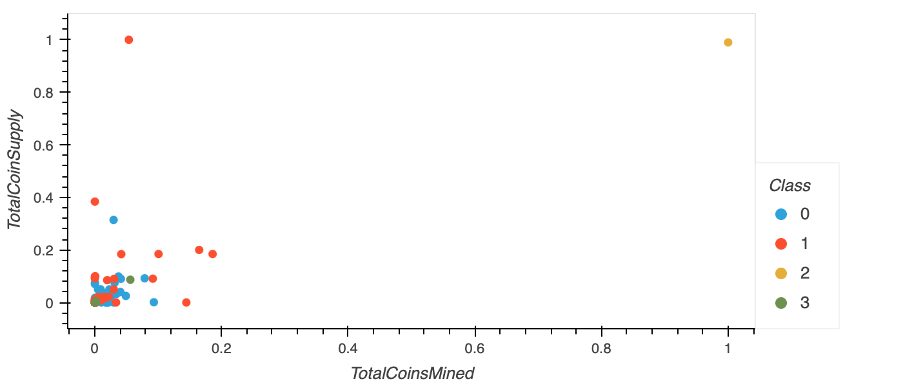
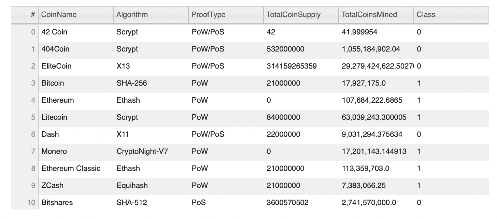

# Cryptocurrencies
Source: [crypto_clustering](crypto_clustering.ipynb)

## Overview

The goal of this analysis is to create a report that includes the types of cryptocurrencies on the trading market and a classification system to group the currencies for client investment portfolios. So, they’ve asked you to create a report that includes what cryptocurrencies are on the trading market and how they could be grouped to create a classification system for this new investment.

## Results

After preprocessing and clustering the data we found there are 4 classes of crypto and there are 532 tradable cryptocurrencies currently on the market.

- Demand 
 

- Tradable Coins 
 

